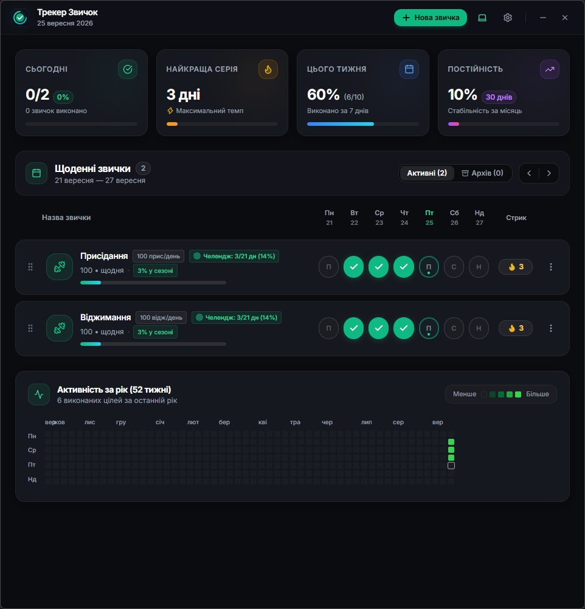
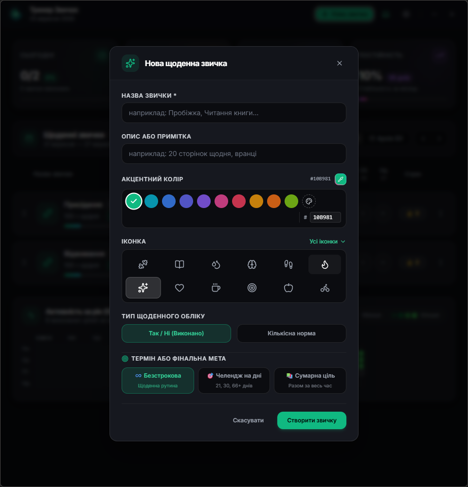
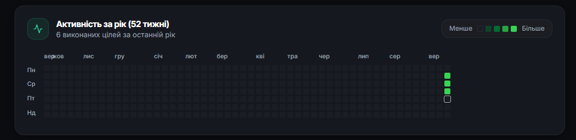
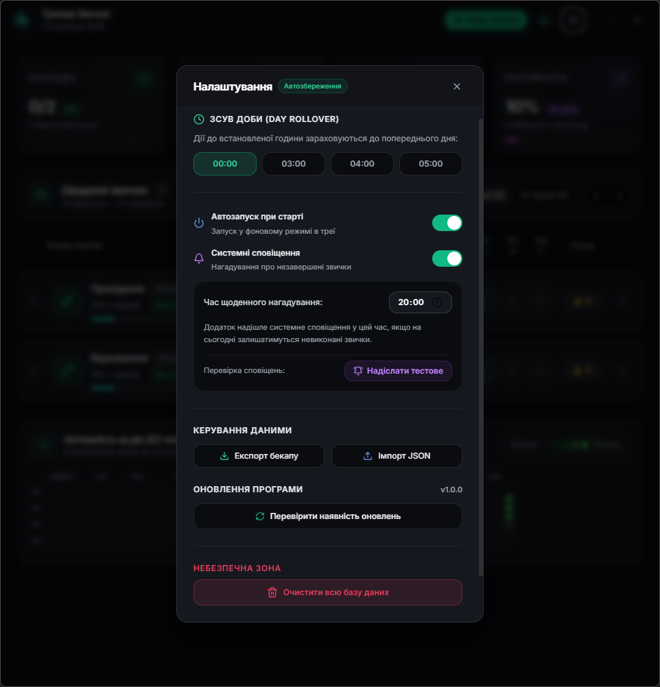

<div align="center">

# ⚡ Трекер Звичок (Daily Habits Desktop)

**Сучасний, швидкий та приватний десктопний трекер щоденних звичок з преміальним темним інтерфейсом.**

[](https://tauri.app)
[](https://react.dev)
[](https://www.typescriptlang.org)
[](https://sqlite.org)
[](https://opensource.org/licenses/MIT)

<br/>

[📥 Завантажити останній реліз](https://github.com/MaxSkyi/DailyHabbits/releases/latest) • [✨ Можливості](#-можливості) • [📸 Скріншоти](#-скріншоти) • [🛠 Розробка](#-встановлення-та-запуск-для-розробників)

<br/>

<!-- Головний банер/скріншот додатку -->


</div>

---

## 🌟 Особливості

- 🔒 **100% Приватність & Offline-First:** Усі ваші дані зберігаються виключно локально у базі даних SQLite (`habits.db`). Ніяких сторонніх серверів, аналітики чи телеметрії.
- ⚡ **Миттєвий відгук (Optimistic UI):** Усі кліки, збереження та перемикання відбуваються миттєво без затримок.
- 🎨 **Преміальний дизайн:** Глибока темна тема (`#0B0C10`), плавні неонові акценти, ефекти підсвічування та конфеті при досягненні 100% денної цілі.
- 📊 **Інтерактивна теплова карта (Heatmap 7x52):** Повна річна візуалізація вашої активності з тултіпами та відсотками виконання кожного дня.
- 🔥 **Облік серій (Streaks):** Автоматичний підрахунок поточних і рекордних серій для кожної звички.
- 🎯 **Два типи звичок:**
  - **Так / Ні (Boolean):** Звичайне виконання (наприклад: *«Медитація»*, *«Читання»*).
  - **Числові цілі (Numeric Goals):** Фіксація кількості та прогресу (наприклад: *«Випити 2000 мл води»*, *«Зробити 50 віджимань»*).
- ⚙️ **Instant Auto-Save:** Налаштування зберігаються на льоту з елегантними підказками без зайвих кнопок.
- 🔔 **Системні сповіщення & Трей:**
  - Згортання у фоновий режим у системний трей (Tray).
  - Персоналізовані щоденні нагадування у зручний для вас час.
  - Автозапуск разом із системою Windows.
- 🔄 **Автоматичні оновлення (Auto-Updater):** Вбудована перевірка та безшовне оновлення програми прямо всередині додатку через GitHub Releases.

---

## 📸 Скріншоти

<div align="center">
  <table>
    <tr>
      <td align="center" width="50%">
        <b>📋 Головний дашборд та список звичок</b><br/><br/>
        
      </td>
      <td align="center" width="50%">
        <b>➕ Створення та редагування звички</b><br/><br/>
        
      </td>
    </tr>
    <tr>
      <td align="center" width="50%">
        <b>📊 Детальна річна теплова карта</b><br/><br/>
        
      </td>
      <td align="center" width="50%">
        <b>⚙️ Налаштування, автозапуск та оновлення</b><br/><br/>
        
      </td>
    </tr>
  </table>
</div>

---

## 📥 Встановлення та використання

1. Перейдіть на сторінку [**Останнього релізу**](https://github.com/MaxSkyi/DailyHabbits/releases/latest).
2. Завантажте файл `Трекер Звичок_x.x.x_x64-setup.exe`.
3. Запустіть встановлення та насолоджуйтесь трекінгом звичок!
4. Всі наступні оновлення програма підтягне самостійно.

---

## 🛠 Технологічний стек

- **Runtime:** [Tauri v2](https://tauri.app) (Rust)
- **Frontend:** [React 18](https://react.dev), [TypeScript](https://www.typescriptlang.org), [Vite](https://vitejs.dev)
- **Стилізація:** [Tailwind CSS](https://tailwindcss.com), [Lucide Icons](https://lucide.dev), [Canvas Confetti](https://github.com/catdad/canvas-confetti)
- **База даних:** [SQLite](https://sqlite.org) (`tauri-plugin-sql`)
- **Системні плагіни:** `tauri-plugin-updater`, `tauri-plugin-notification`, `tauri-plugin-autostart`
- **CI/CD:** GitHub Actions (автоматична збірка релізів та підпис інсталяторів)

---

## 💻 Встановлення та запуск для розробників

Якщо ви хочете зібрати або запустити проєкт локально:

### Попередні вимоги:
- Встановлений [Node.js](https://nodejs.org/) (v18 або новіший)
- Встановлений [Rust & Cargo](https://www.rust-lang.org/tools/install)
- Встановлені компоненти [C++ Build Tools](https://visualstudio.microsoft.com/visual-cpp-build-tools/) (для Windows)

### Кроки запуску:

1. **Клонуйте репозиторій:**
   ```bash
   git clone https://github.com/MaxSkyi/DailyHabbits.git
   cd DailyHabbits
   ```

2. **Встановіть залежності:**
   ```bash
   npm install
   ```

3. **Запустіть у режимі розробки:**
   ```bash
   npm run tauri dev
   ```

4. **Збірка релізного інсталятора:**
   ```bash
   npm run tauri build
   ```

---

## 📄 Ліцензія

Цей проєкт розповсюджується під ліцензією **MIT License**. Дивіться файл [LICENSE](LICENSE) для детальної інформації.
